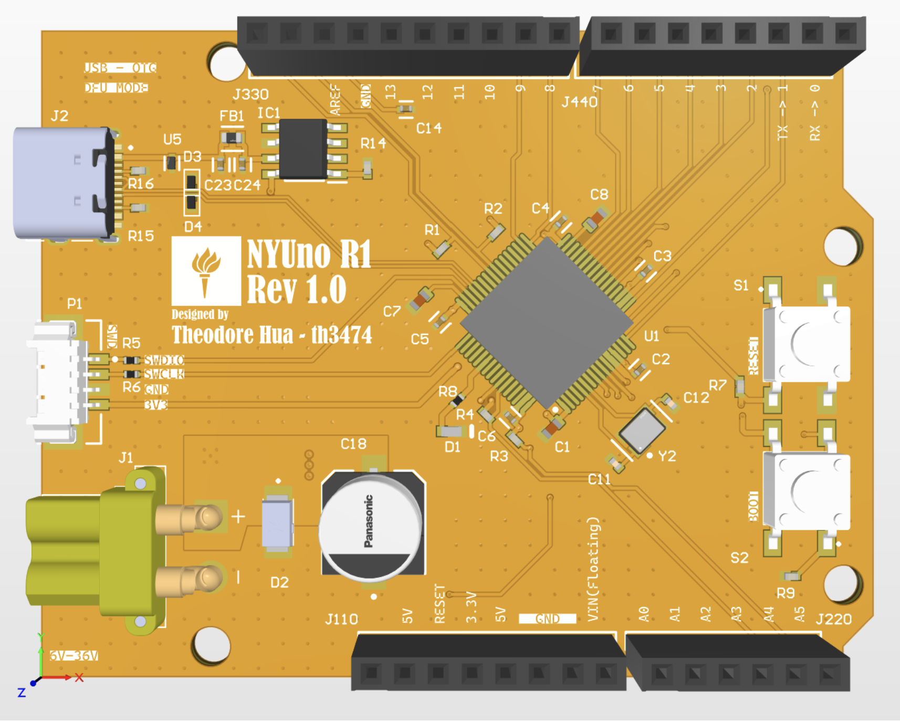
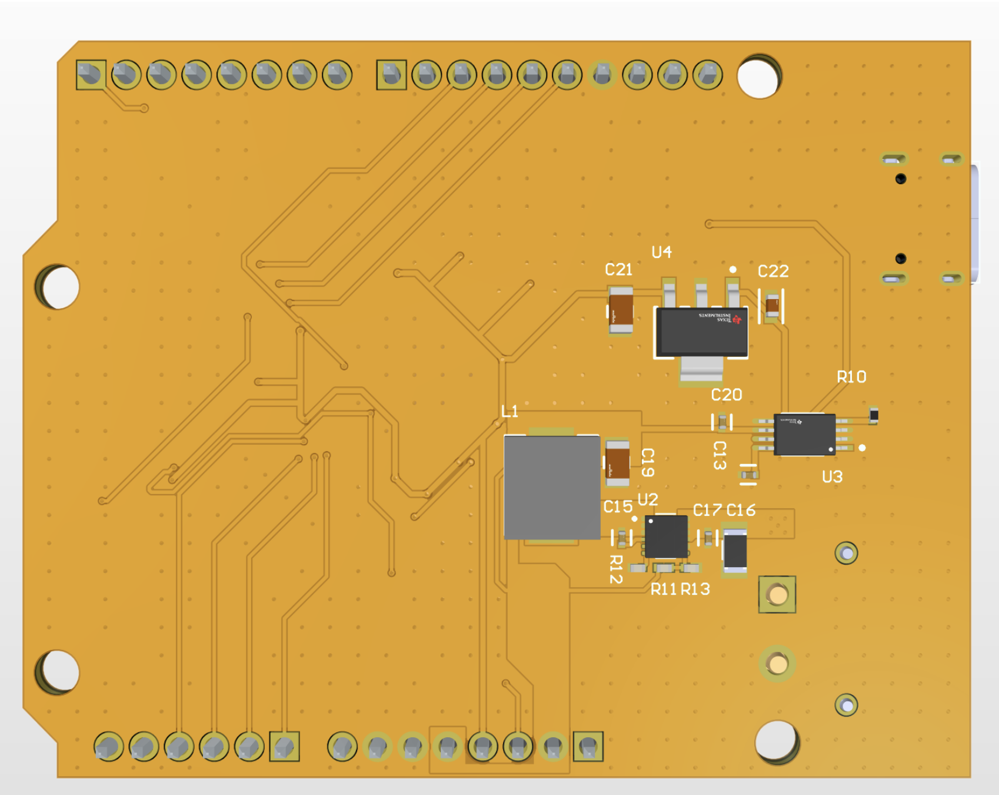
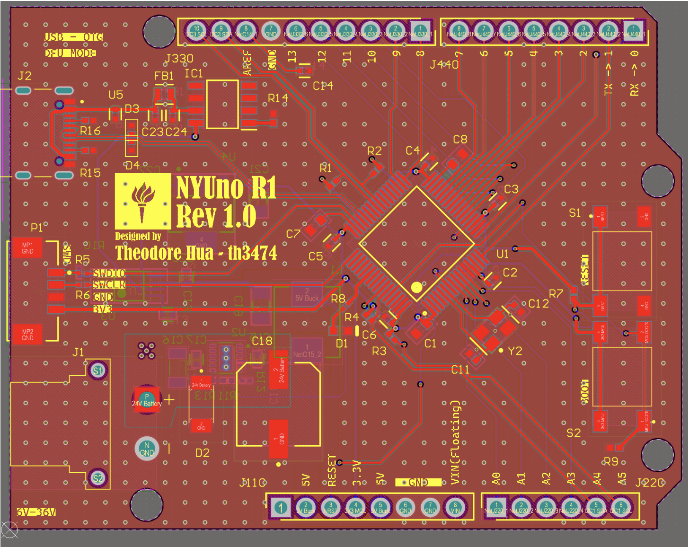
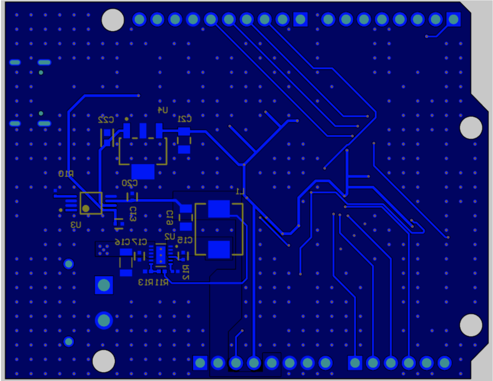
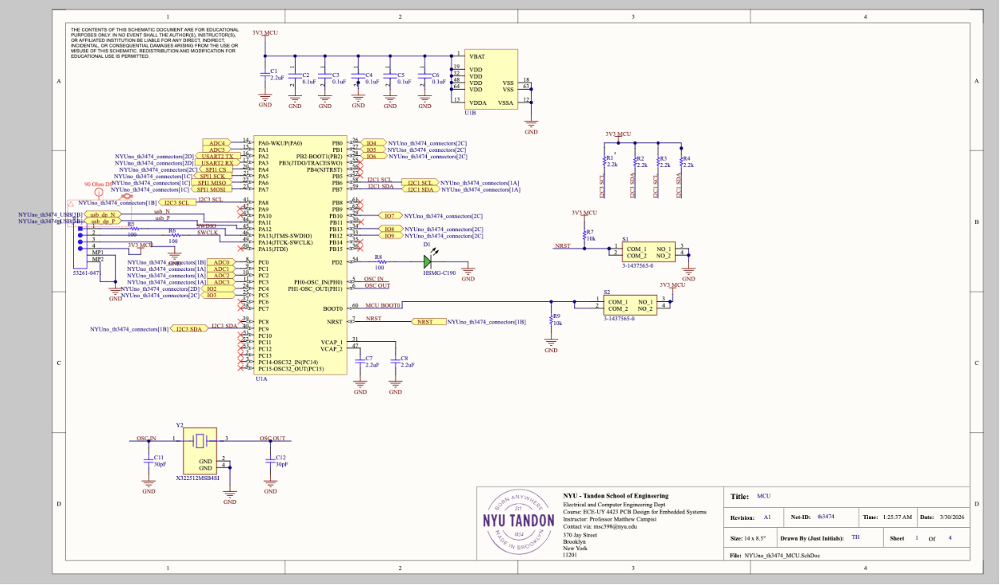
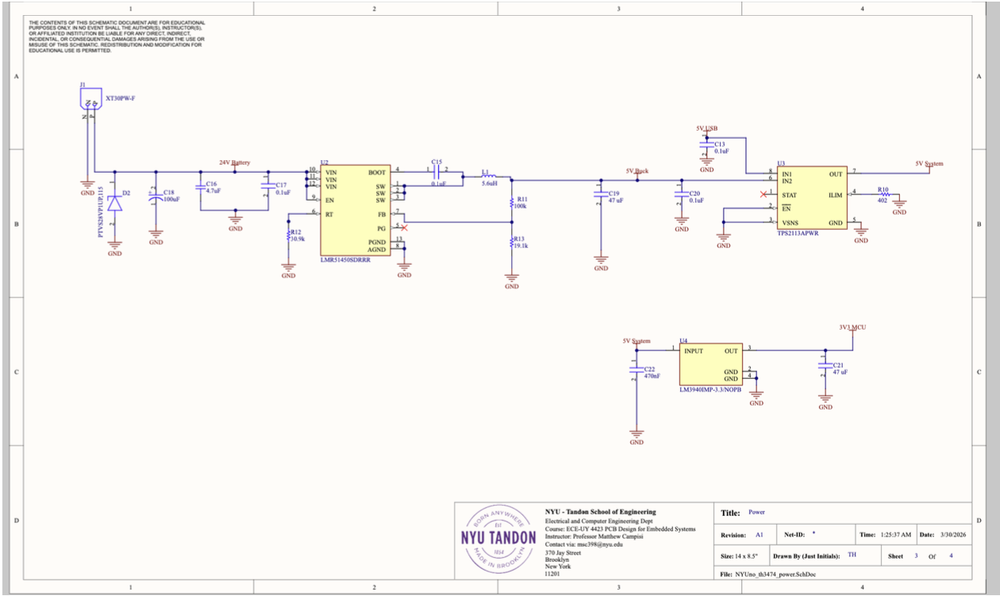
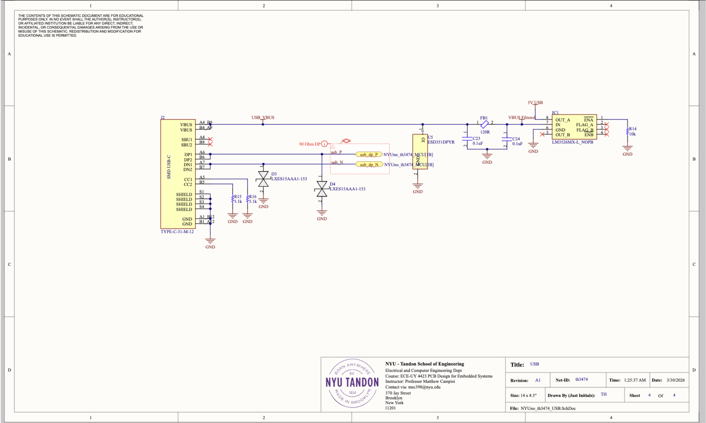
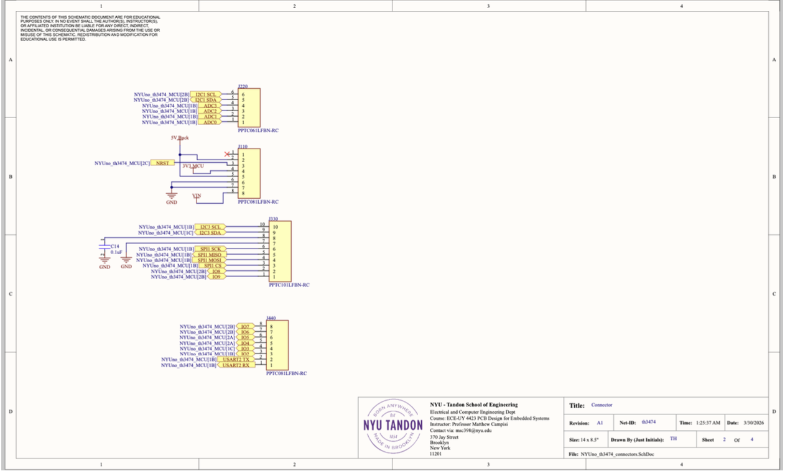
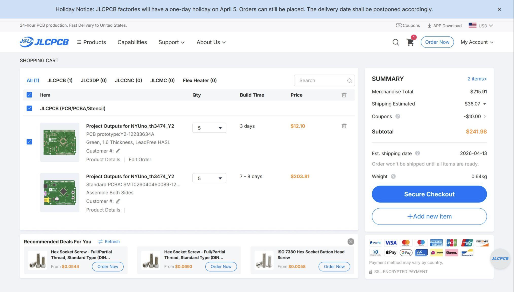

# NYUno R1 Rev 1.0

A custom Arduino Uno-inspired development board designed by Theodore Hua for ECE-UY 4423 — PCB Design for Embedded Systems at NYU Tandon School of Engineering.

---

## Overview

NYUno is a significant hardware upgrade over the Arduino Uno R3, replacing its three core subsystems — power delivery, microcontroller, and USB communication — with more capable modern components while maintaining Arduino Uno pin compatibility.

| Feature | Arduino Uno R3 | NYUno R1 |
|---|---|---|
| Input Voltage | 7–12V | 6–36V |
| Power Regulation | Single LDO | Buck Converter + LDO |
| MCU | ATmega328P (8-bit AVR, 16 MHz, 2KB RAM) | STM32F405 (32-bit ARM Cortex-M4) |
| USB | ATmega16U2 (USB-to-serial bridge) | STM32F405 integrated USB controller |
| Power Sources | Manual selection | Automatic muxing via TPS2113A |

---

## PCB Layout

### 3D Views

| Top | Bottom |
|:---:|:---:|
|  |  |

### 2D Layer Views

| Top Layer | Bottom Layer |
|:---:|:---:|
|  |  |

---

## Schematics

### MCU (STM32F405)

### Power Subsystem

### USB Subsystem

### Connectors

---

## Hardware Architecture

### Power Subsystem
- **Input**: XT30PW-F barrel connector (6–36V) or USB-C (5V)
- **Buck Converter**: Steps down high input voltage to 5V efficiently (LMR51450SDRRR), supporting up to 5A load
- **LDO**: Further regulates 5V to 3.3V for MCU (LM3940IMP-3.3)
- **Power Muxing**: TPS2113A automatically selects between XT30 and USB-C inputs, giving priority to the barrel connector
- **Protection**: TVS diode + bulk capacitor at XT30 input for ESD/surge clamping; pi filter + ESD protection on USB-C VBUS; inrush current limiting on USB load switch

> At maximum input (36V) with a 5A load, a single LDO would dissipate 155W — far exceeding safe limits. The buck converter solves this with ~92% efficiency.

### MCU Subsystem
- **MCU**: STM32F405RGT6 (32-bit ARM Cortex-M4, up to 168 MHz, 192KB RAM, 1MB Flash)
- **Decoupling**: 20× 100nF capacitors placed per STM32 datasheet, one per power pin
- **Programming**: Supports both USB DFU (via USB-C, no extra hardware) and SWD/JTAG (via 53261-047 header for real-time debugging)
- **Buttons**: nRESET and BOOT0 for entering DFU mode

### USB Subsystem
- **Connector**: USB-C (TYPE-C-31-M-12)
- **ESD Protection**: Bidirectional low-capacitance TVS diodes (LXES15AAA1-153)
- **Differential Pair**: Impedance-matched to 90Ω (USB 2.0 spec) using edge-coupled microstrip
  - Trace width: 9.5196 mil, spacing: 5 mil, dielectric height: 0.21040mm (JLCPCB stackup)
- **Overcurrent Protection**: LM3526MX-L load switch on VBUS

### Grounding & Signal Integrity
- **4-layer stackup**: Signal | GND | Power | Signal — continuous adjacent ground planes for short return paths
- **Via stitching**: Applied across the board post-routing, >80 mil spacing
- **3 GND vias** on the buck converter to minimize return path inductance

---

## PCB Specifications

| Parameter | Value |
|---|---|
| Board Size | 68.6 × 53.3 mm (Arduino Uno form factor) |
| Layers | 4 |
| PCB Thickness | 1.6 mm |
| Surface Finish | LeadFree HASL |
| Min Trace Width | 0.127 mm |
| Min Clearance | 0.102 mm |
| Via Drill Size | ≥ 0.025 mm |
| DRC Violations | 0 (49 silk-to-pad warnings, cosmetic only) |

---

## Bill of Materials (Key ICs)

| Designator | Part | Description |
|---|---|---|
| U1 | STM32F405RGT6 | 32-bit ARM Cortex-M4 MCU |
| U2 | LMR51450SDRR | Buck converter (6–36V → 5V) |
| U3 | TPS2113APWR | 2-input automatic power mux |
| U4 | LM3940IMP-3.3 | LDO regulator (5V → 3.3V) |
| U5 | BNE5D310PYR | ESD protection (USB-C) |
| IC1 | LM3526MX-L | USB VBUS load switch / overcurrent protection |
| D1 | PTV528VPUP3T5 | TVS diode (XT30 input protection) |
| D3/D4 | LXES15AAA1-153 | Bidirectional TVS diodes (USB differential pair) |
| L1 | 5.6µH | Buck converter output filter inductor |
| Y2 | X322512MSB4SI | 12 MHz crystal oscillator |
| J1 | XT30PW-F2G | XT30 power input connector (6–36V) |
| J2 | TYPE-C-31-M-12 | USB-C connector |

Full BOM available via JLCPCB project outputs.

---

## Fabrication & Assembly

This board is ready to be manufactured and assembled by **JLCPCB**.

- **Gerber files**: Describe each copper/silkscreen/mask layer for fabrication
- **NC Drill files**: Specify drill hole locations and sizes
- **BOM + CPL**: Used for JLCPCB SMT assembly (both sides assembled)
- **Assembly cost**: ~$241.98 for 5 boards (including SMT assembly)

When selecting components for JLCPCB assembly, prioritize parts with large in-stock quantities and match current/voltage ratings, pin-outs, and package sizes carefully.

---

## Development Tools

- **EDA**: Altium Designer 26.2
- **Buck Converter Design**: TI WeBench Power Designer
- **Impedance Calculator**: DigiKey IPC-2141 Trace Impedance Calculator
- **Manufacturing**: JLCPCB

---

## Project Timeline

| Week | Milestone |
|---|---|
| 1 | LED Chaser — learned Altium basics, Gerber/NC-Drill export |
| 2 | Imported component libraries; initialized NYUno project |
| 3–4 | STM32F405 pin breakout mapping; 4-layer PCB setup and polygon pours |
| 5 | Buck converter design with WeBench; power schematic in Altium |
| 6 | USB schematic; ESD/overcurrent protection; impedance matching |
| 7 | Finalized component placement; set JLCPCB design rules; routing complete |
| 8 | Configured JLCPCB order; matched BOM to available components; submitted for fabrication |

---

## Known Limitations & Future Work

- 49 silk-to-solder mask clearance warnings (cosmetic, no functional impact)
- Future revision may add a second USB-C port for simultaneous power and data
- SWD/JTAG header could be more accessible in a future layout revision

---

## Author

**Theodore Hua** (`th3474`)  
NYU Tandon School of Engineering  
ECE-UY 4423 — PCB Design for Embedded Systems  
